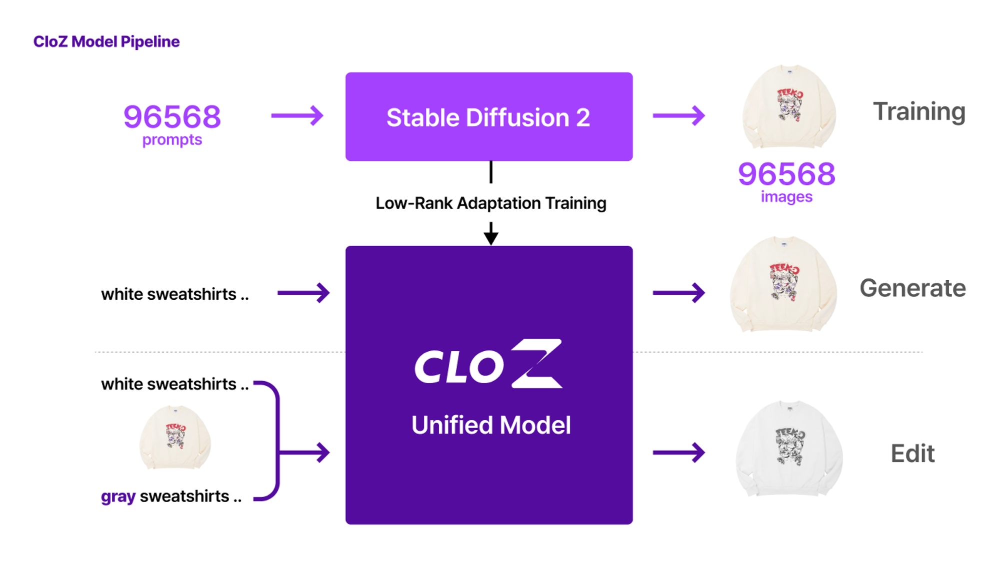

## Project Description

**CloZ** is a clothing design system facilitated by natural language prompts. Cloz supports two main functions; **1) generating clothing images via natural language prompting. 2) editing generated images by replacing keywords from previous prompts.**

Inspired by [FACAD [1]](https://github.com/xuewyang/Fashion_Captioning), we first built the [nordstrom96568 dataset](https://huggingface.co/datasets/jasonchoi3/nordstrom96568), which consists of 96568 (prompt, clothing image) pairs. Then we trained [stable diffusion [2] 2.1](https://github.com/Stability-AI/stablediffusion) with our dataset to generate clothing images using prompts. The editing function was implemented by [CycleDiffusion [3]](https://github.com/ChenWu98/cycle-diffusion). Also, we designed the CloZ's web-based interface based on guidelines of prior research [4].
