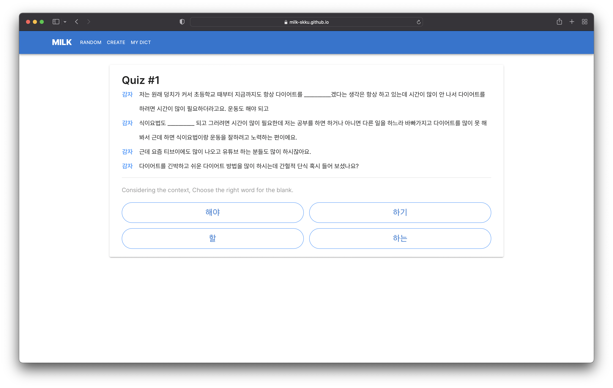
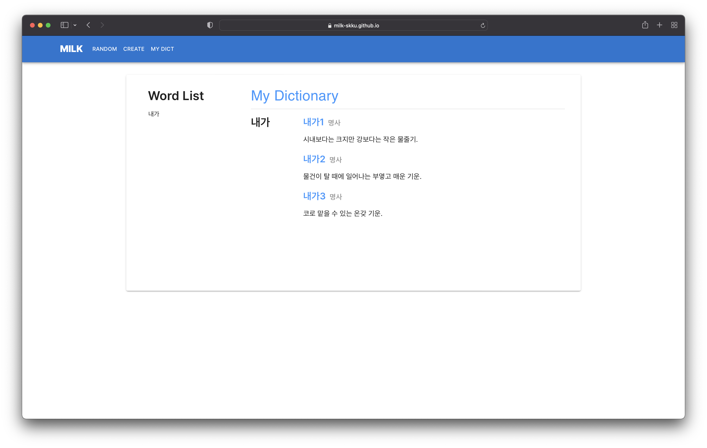

## Project Description

MILK is a Korean context inference quiz based on Word Embedding (FastText). It calculates the Representation Vector of individual words using a Pretrained FastText model. The average vector of these word vectors is considered the Context Vector representing the given context. The word with the highest Cosine Similarity to the Context Vector among the vectors of words forming the context is generated as the blank. The answer choices are generated using the k-Nearest Neighbor algorithm to select words located in similar positions in the vector space as the target word, thereby increasing the difficulty of the questions and allowing learners to combine subtle nuances and contexts of words.

